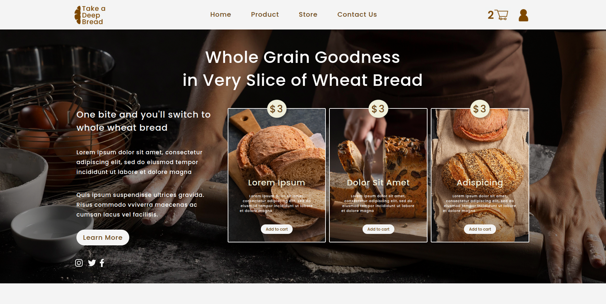

# BREAD SITE

A simple one-page website created to refresh my HTML and CSS skills.

## Description
This project was made to revisit the basics of HTML and CSS layout.  
The site is dedicated to bread — featuring images, text, and basic styling.

## Screenshots

## Technologies Used
- HTML
- CSS
- JavaScript

## How to Run
Just open the `index.html` file in any modern web browser.

Or visit the site here: <a href="https://taras-bilyk.github.io/bread_site/">https://taras-bilyk.github.io/bread_site/</a>

## Project Structure
- `index.html` — main page
- `css/` — stylesheets
- `img/` — images
- `js/` — script for burger menu

## Project Goal
To practice web development fundamentals, layout structure, and repository setup.

---

